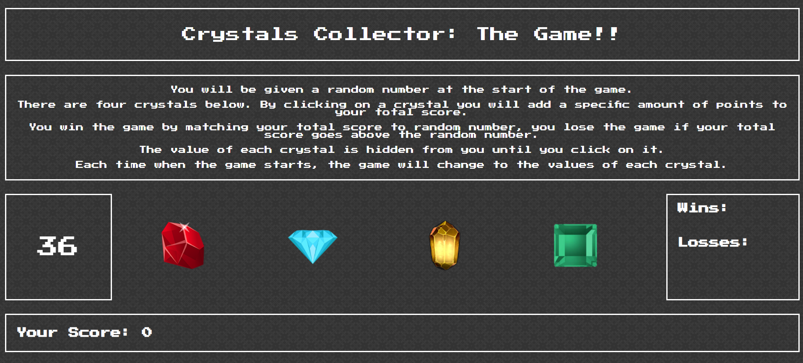

# Crystals Collector

**Creator**: `Scott Ladd`

**Created on**: `Sep 17th 2019`

- - -

## ABOUT THE APP
Crystals Collector is a fun guessing game that lets you guess what number the crystals are equal to.

## HOW TO PLAY
You will be given a random number at the start of the game. There are four crystals. By clicking on a crystal you will add a specific amount of points to your total score. You win the game by matching your total score to random number, you lose the game if your total score goes above the random number. The value of each crystal is hidden from you until you click on it. Each time when the game starts, the game will change to the values of each crystal.

- - -

## Deployed Site

[Click Here](https://scottjr101.github.io/unit-4-game/)

- - -

## TECHNOLOGIES USED
* Javascript
* CSS
* HTML
* Git
* GitHub